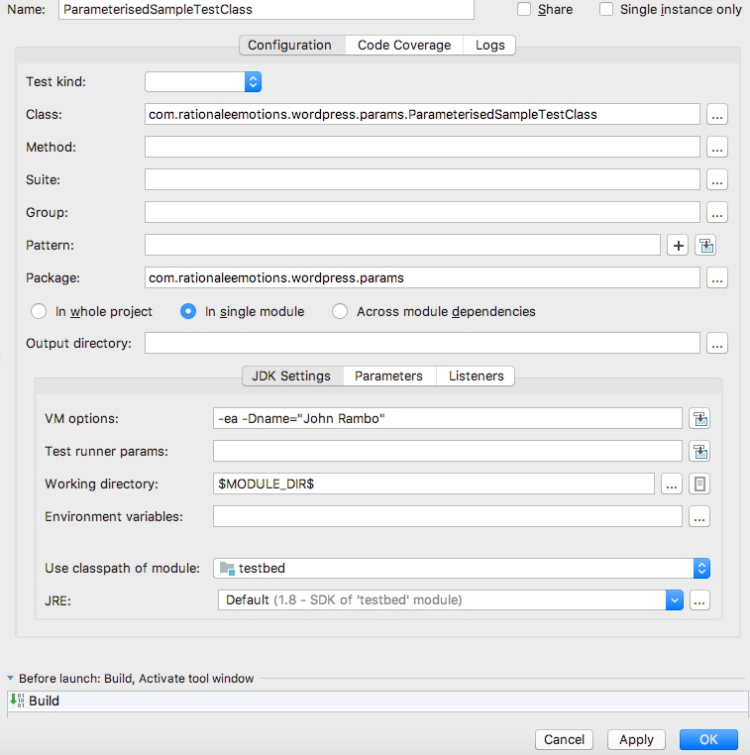

TestNG provides us users with two ways in you can achieve data driven tests.

1. You make use of the `@DataProvider` annotation wherein you bind your `@Test` method with a data source.
2. You make use of the `@Parameters` annotation and have your `@Test` method read values from a suite xml file.

There are enough blogs and documentation pages that talk about both these aspects of data driven support that TestNG provides.

We will look at one unique aspect of `@Parameters` annotation which is not documented anywhere.

Lets say we have a test class which looks like below :

```java
package com.rationaleemotions.wordpress.params;

import org.testng.annotations.Parameters;
import org.testng.annotations.Test;

public class ParameterisedSampleTestClass {
    @Test
    @Parameters("name")
    public void hello(String name) {
        System.err.println("Hello " + name + " !");
    }
}
```

As seen above the test method `hello()` is expecting a parameter named `name` to be passed in via the suite xml file.

The suite file would look like below :

```xml
<!DOCTYPE suite SYSTEM "http://testng.org/testng-1.0.dtd" >
<suite name="sample_suite" verbose="1" parallel="false" thread-count="2">
  <test name="sample_test">
    <parameter name="name" value="Krishnan"/>
    <classes>
      <class name="ParameterisedSampleTestClass" />
    </classes>
  </test>
</suite>
```

The straight forward way of changing the parameter `name` is by altering it in the TestNG suite xml.

But this can be cumbersome because we have to keep changing the suite xml file every time.

We could otherwise consider building a listener that implements `org.testng.ISuiteListener` or `org.testng.ITestListener` and then within these listener implementations build logic of reading the parameters either from within the `ITestContext` (or) from within the ISuite and then change the values.

Certainly doable. But it also looks a bit too complicated, considering the fact that all we wanted to do was change the value of the parameter at runtime without changing our suite xml.

Well, today when I was fixing an issue in the TestNG codebase, I stumbled into this little treasure chest, which shows a much easier way of doing this in TestNG.

The easiest way of changing the values of parameters at runtime is to pass them via the JVM argument.

_TestNG has the capability built into it wherein it also queries the System properties (JVM arguments) and tries to read the values of parameters whose name matches with what was given in the suite xml file._

Here’s how you run it via Maven:

```bash
mvn clean test -Dname="John Rambo" -Dtest=ParameterisedSampleTestClass
```

Here’s how you run it if you were using Gradle:

```bash
gradle clean test -Dname="John Rambo" -Dtest.single=ParameterisedSampleTestClass
```

Just remember to add
`systemProperties(System.getProperties())` to your gradle build’s test section. This is because it seems Gradle doesn’t by default pass the JVM arguments it receives from the user to the test JVM. You can read more about this behavior in this stackoverflow thread.

If you were to be running them via an IDE such as IntelliJ, your run configuration would look like below:


