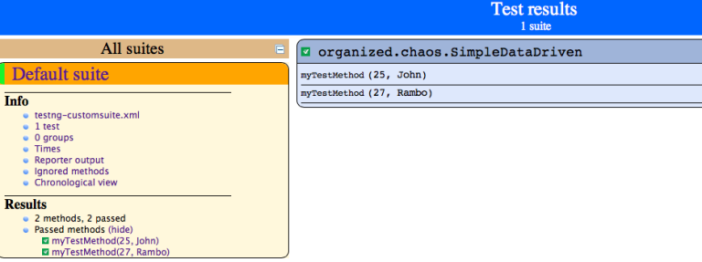
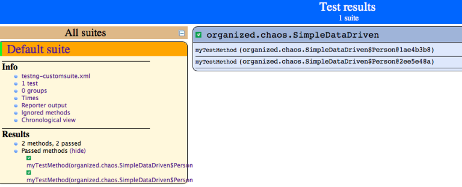
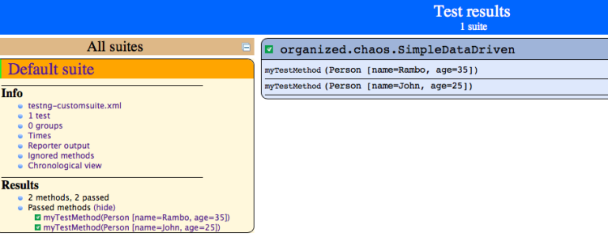
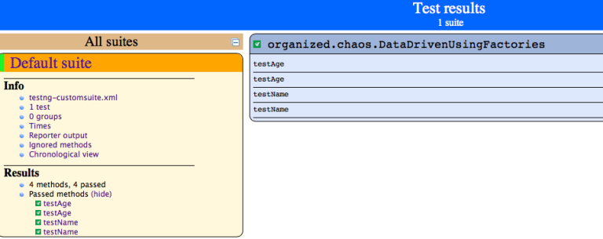

We all at some point or the other have had to deal with tests that are data driven. One of the frequently asked question that I have seen on TestNG is how do I make sure that the test out put makes sense when it involves data driven tests.

So lets consider 3 scenarios, all of which involve Data Providers in TestNG.

### Scenario 1: DataProvider feeds simple data to the @Test annotated test method.

Your test is powered by a DataProvider but it gives out simple data types as parameters. Take a look at the below code snippet.

```java
package organized.chaos;

import static org.testng.Assert.assertNotNull;
import static org.testng.Assert.assertTrue;
import org.testng.annotations.Test;
import org.testng.annotations.DataProvider;

public class SimpleDataDriven {
    @Test(dataProvider = "dp")
    public void myTestMethod(int age, String s) {
        assertNotNull(s);
        assertTrue(age != 0);
    }

    @DataProvider
    public Object[][] dp() {
        return new Object[][] { new Object[] { 25, "John" }, new Object[] { 27, "Rambo" }, };
    }
}

```

This is the most simplest of test methods that are powered by a DataProvider.

The output would look as below



As you can see, as long as the parameters to the `@Test` annotated test method are simple types, the output looks pretty. But not always do we have this luxury of having simple data types as the parameters for test methods. That brings us to our next Scenario viz., the `@Test` annotated test method is powered by a DataProvider which provides custom objects for every iteration.

### Scenario 2: DataProvider feeds custom objects to the @Test annotated test method.

Consider the following test code which accepts a custom object as a parameter for the test method.

```java
package organized.chaos;

import static org.testng.Assert.assertNotNull;
import static org.testng.Assert.assertTrue;
import org.testng.annotations.Test;
import org.testng.annotations.DataProvider;

public class SimpleDataDriven {
    @Test(dataProvider = "dp")
    public void myTestMethod(Person person) {
        assertNotNull(person.getName());
        assertTrue(person.getAge() != 0);
    }

    @DataProvider
    public Object[][] dp() {
        return new Object[][] {
            { new Person("John", 25) },
            { new Person("Rambo", 35) }
        };
    }

    static class Person {
        private String name;
        private int age;

        public Person(String name, int age) {
            this.name = name;
            this.age = age;
        }

        public String getName() {
            return name;
        }

        public int getAge() {
            return age;
        }
    }
}

```

The output would look as below



As you can see the test report doesnt say a lot of things. It shows that the test method has two iterations but we dont have a clue as to what was the values that was used for every iteration.

But this was exactly how our previous example also looked like. Then how is it that the previous output was “pretty printed” but this one is not ?
The answer lies in the parameters of the @Test annotated test methods and the way in which TestNG handles them.

With primitive data types such as int, chars etc., TestNG automatically takes care of showing them properly in the test reports. With custom classes such as `String` TestNG merely invokes the toString() method on the custom object.

Since in our `Person` class we don’t have a `toString()` implementation, the default implementation available in the Object class [Remember Object class is the mother of all classes in Java] is invoked. The default `toString()` implementation in the Object class merely prints the class name along with the hashcode of the Object in the hexadecimal format.

So we would need to refactor our code [especially the `Person` class] and add a `toString()` implementation to it. So the refactored test code would look like below:

```java
package organized.chaos;

import static org.testng.Assert.assertNotNull;
import static org.testng.Assert.assertTrue;
import org.testng.annotations.Test;
import org.testng.annotations.DataProvider;

public class SimpleDataDriven {
    @Test(dataProvider = "dp")
    public void myTestMethod(Person person) {
        assertNotNull(person.getName());
        assertTrue(person.getAge() != 0);
    }

    @DataProvider
    public Object[][] dp() {
        return new Object[][] {
            { new Person("John", 25) },
            { new Person("Rambo", 35) }
        };
    }

    static class Person {
        private String name;
        private int age;

        public Person(String name, int age) {
            this.name = name;
            this.age = age;
        }

        public String getName() {
            return name;
        }

        public int getAge() {
            return age;
        }

        @Override
        public String toString() {
            StringBuilder builder = new StringBuilder();
            builder.append("Person [name=")
            .append(name)
            .append(", age=")
            .append(age)
            .append("]");
            return builder.toString();
        }
    }
}
```

The output would look as below



As you can now see, the test results shows the custom object’s contents that were passed for every iteration.

The last scenario that we are going to consider is how do we have the test reports show information for every iteration.

### Scenario 3: DataProvider feeds custom objects to a @Factory

Consider the following test code which is being powered by `@Factory` annotation. We will first look at how the output of the tests look “cryptic” and then we will go about refactoring it to reveal information for every iteration. Without further delay, here’s the code:

```java
package organized.chaos;

import static org.testng.Assert.assertNotNull;
import static org.testng.Assert.assertTrue;

import org.testng.annotations.Factory;
import org.testng.annotations.Test;
import org.testng.annotations.DataProvider;

public class DataDrivenUsingFactories {
    private String name;
    private int age;

    @Factory(dataProvider = "dp")
    public DataDrivenUsingFactories(String name, int age) {
        this.name = name;
        this.age = age;
    }

    @Test
    public void testName() {
        assertNotNull(name);
    }

    @Test
    public void testAge() {
        assertTrue(age != 0);
    }

    @DataProvider
    public static Object[][] dp() {
        return new Object[][] {
            { "John", 30 },
            { "Rambo", 40 }
        };
    }
}
```

The output would look as below:



Our test code had 2 `@Test` annotated test methods and the DataProvider provided two iterations but the output that we see doesnt give us any hint on what were the values that were used for every iteration.

This is where we leverage a feature TestNG provides viz., an ability to provide custom names to test classes via the `org.testng.ITest` interface. If a Test class implements this interface then TestNG guarantees that it will be invoked in order to print the test method name. So lets see how our re-factored code will look like:

```java
package organized.chaos;

import static org.testng.Assert.assertNotNull;
import static org.testng.Assert.assertTrue;

import org.testng.ITest;
import org.testng.annotations.Factory;
import org.testng.annotations.Test;
import org.testng.annotations.DataProvider;

public class DataDrivenUsingFactories implements ITest {
    private String name;
    private int age;

    @Factory(dataProvider = "dp")
    public DataDrivenUsingFactories(String name, int age) {
        this.name = name;
        this.age = age;
    }

    @Test
    public void testName() {
        assertNotNull(name, "Name validation successful");
    }

    @Test
    public void testAge() {
        assertTrue(age != 0, "Age validation successful");
    }

    @DataProvider
    public static Object[][] dp() {
        return new Object[][] {
            { "John", 30 },
            { "Rambo", 40 }
        };
    }

    public String getTestName() {
        StringBuilder builder = new StringBuilder();
        builder.append("[name=")
        .append(name)
        .append(", age=")
        .append(age)
        .append("]");
        return builder.toString();
    }
}

```

The output would look as below

```
[TestNG] Running:
  /private/var/folders/47/hs5x_y397rsf8vbfqmqrmngm0000gn/T/testng-eclipse-336434888/testng-customsuite.xml

PASSED: [name=John, age=30]
PASSED: [name=Rambo, age=40]
PASSED: [name=John, age=30]
PASSED: [name=Rambo, age=40]
```

The flip-side of this is that, when your test class has more than 1 `@Test` annotated test method the output doesn’t seem to show the method name that passed. But then again, this is something that can be taken care of if you build your own reporting mechanism using the `IReporter` interface.
